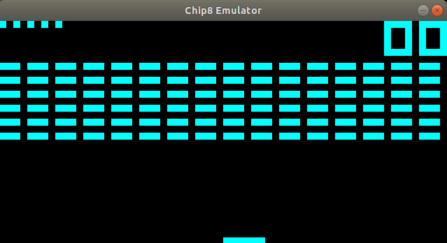

# CHIP8 EMULATOR

This is a chip8 Emulator that was written in C11 and SDL2. Chip8 is an interpreted programming language
developed by Joseph Weisbecker in the mid 1970's. Chip8 was originally developed for the COSMAC VIP and
TELMAC 1800 8-bit microcomputers. Made to allow video games to be more easily programmed for these computers.
Later on they would start to appear for some models of graphing calculators.

## Dependencies 

I used [SDL2](https://www.libsdl.org/download-2.0.php) to implement the graphics.

## Installing

Use the `make` command to compile

## Running the Emulator

Run this emulator from the command line. The first argument should be the path to the game.
I have included some roms such as Tetris and Brix but there are many games you can find on the internet.

`$ ./CH8Emulator rom/path`

## Thanks

* [Chip8 roms](https://www.zophar.net/pdroms/chip8.html)
* [SDL2 API](https://wiki.libsdl.org/APIByCategory)
* [Emulator 101](http://www.emulator101.com/)
* [How to write an emulator - Chip8 Interpreter](http://www.multigesture.net/articles/how-to-write-an-emulator-chip-8-interpreter/)
* [Cowgod's Chip8 Reference](http://devernay.free.fr/hacks/chip8/C8TECH10.HTM#00E0)
* [Chip8 - Wiki](https://en.wikipedia.org/wiki/CHIP-8)

